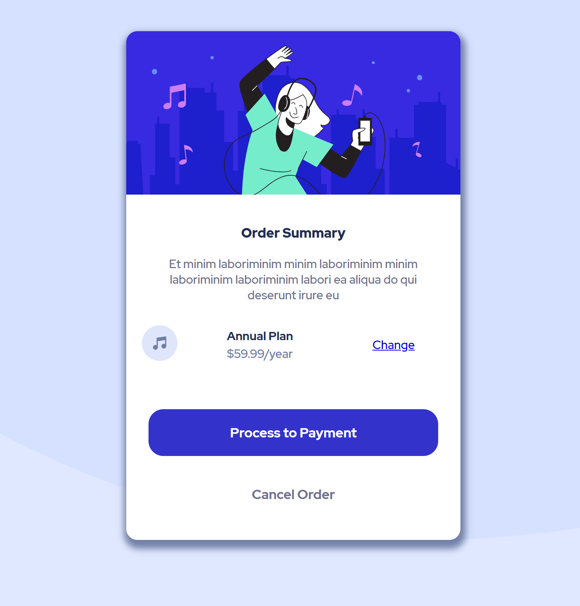

# Frontend Mentor - Order summary card solution

This is a solution to the [Order summary card challenge on Frontend Mentor](https://www.frontendmentor.io/challenges/order-summary-component-QlPmajDUj). Frontend Mentor challenges help you improve your coding skills by building realistic projects. 

## Table of contents

- [Overview](#overview)
  - [The challenge](#the-challenge)
  - [Screenshot](#screenshot)
  - [Links](#links)
- [My process](#my-process)
  - [Built with](#built-with)
  - [What I learned](#what-i-learned)
  - [Continued development](#continued-development)
- [Author](#author)
- [Acknowledgments](#acknowledgments)


## Overview

### The challenge

[Order summary component](https://www.frontendmentor.io/challenges/order-summary-component-QlPmajDUj/hub/order-summary-component-yS8fM1_as)

### Screenshot




### Links

- Live Site URL: [https://h2000x.github.io/order-summary-component-main/](https://h2000x.github.io/order-summary-component-main/)

## My process

### Built with

- Semantic HTML5 markup
- CSS variables
- Flexbox
- VS Code


### What I learned

Using flex to align div's.

```html
                <div class="plan_information-wrapper">
                    <div class="icon">
                        
                    </div>
                    <div class="name_and_price">
                        <div class="plan_name">Annual Plan</div>
                        <div class="plan_price">$59.99/year</div>
                    </div>
                    <div class="change-link"><a href="#">Change</a></div>
                </div>

```
```css
.plan_information-wrapper{
    display: flex;
    align-items:center;
}
```

### Continued development

All the color naming should be in hsl.


## Author

- [@h2000x](https://www.frontendmentor.io/profile/h2000x)


## Acknowledgments

I leaned a lot about css from [Kevin Powell](https://www.youtube.com/kepowob)
